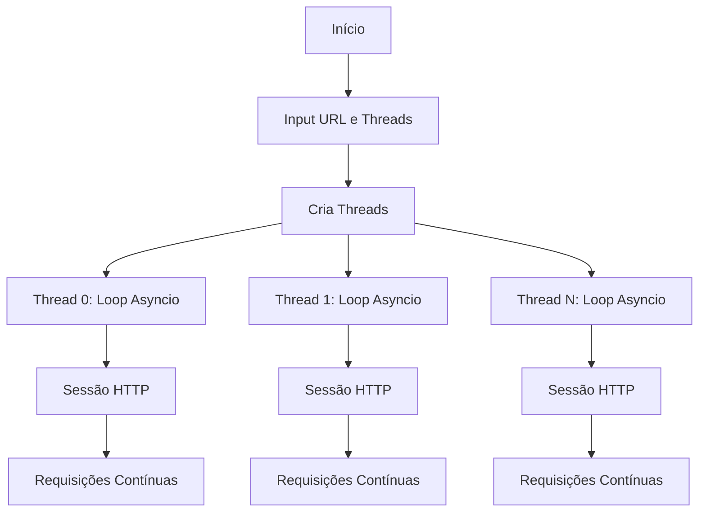

<p align="center">
  
</p>
Async HTTP Load Tester

Este script Python implementa um teste de carga HTTP assíncrono usando múltiplas threads, cada uma executando seu próprio loop de eventos asyncio.

🚀 Funcionalidades

· Teste de carga assíncrono: Realiza múltiplas requisições HTTP concorrentemente
· Arquitetura multi-thread: Cada thread roda um loop de eventos asyncio isolado
· Configuração flexível: URL e número de threads configuráveis pelo usuário
· Resiliência: Tratamento de erros com reconexão automática
· Monitoramento em tempo real: Exibe status de cada thread durante a execução

📋 Pré-requisitos

```bash
pip install aiohttp
```

🛠️ Como Usar

1. Execute o script:

```bash
python script.py
```

1. Insira a URL de destino (com ou sem http://):

```
URL de destino: http://exemplo.com
```

1. Defina o número de threads paralelas:

```
Número de Threads: 10
```

1. O script iniciará o teste de carga. Para interromper, pressione Ctrl+C.

⚙️ Arquitetura

Componentes Principais

1. Threads Isoladas: Cada thread executa um loop de eventos asyncio independente
2. Sessões por Thread: Cada thread possui sua própria aiohttp.ClientSession para segurança
3. Worker Assíncrono: Loop infinito que faz requisições GET com tratamento de erros
4. Controle de Taxa: Pausa de 0.1s entre requisições para evitar sobrecarga

Fluxo de Execução



⚠️ Considerações Importantes

Segurança de Threads

· Cada thread cria sua própria sessão HTTP (ClientSession)
· Objetos asyncio não são compartilhados entre threads
· Evita problemas de concorrência com estruturas isoladas

Performance

· Vantagem: Alta concorrência com baixo consumo de recursos
· Limitação: Rate limit de 0.1s entre requisições (ajustável)
· Escalabilidade: Número de threads limitado pela máquina e servidor alvo

Uso Ético

· Use apenas em servidores que você possui ou tem permissão para testar
· Respeite os termos de serviço e políticas de uso aceitável
· Considere o impacto no servidor alvo

🐛 Solução de Problemas

Erros Comuns

1. RuntimeError: Event loop is closed
   · Causa: Tentativa de reutilizar loop entre threads
   · Solução: Cada thread cria seu próprio loop (já implementado)
2. Conexões Recusadas
   · Causa: Servidor sobrecarregado ou bloqueando requisições
   · Solução: Reduza o número de threads ou aumente o intervalo
3. Alto Uso de CPU/Memória
   · Causa: Muitas threads ou requisições muito rápidas
   · Solução: Ajuste await asyncio.sleep(0.1) para um valor maior

🔧 Personalização

Ajuste de Performance

```python
# Modifique no código:
await asyncio.sleep(0.1)  # Intervalo entre requisições
```

Adição de Headers

```python
async with session.get(url, headers={'User-Agent': '...'}) as response:
```

Timeout Configurável

```python
timeout = aiohttp.ClientTimeout(total=10)
async with aiohttp.ClientSession(timeout=timeout) as session:
```

📊 Monitoramento

O script fornece feedback em tempo real:

· Início de cada thread
· Status HTTP de cada requisição
· Erros detectados
· Controle por terminal via Ctrl+C

🤝 Contribuindo

1. Fork o repositório
2. Crie uma branch para sua feature
3. Commit suas mudanças
4. Push para a branch
5. Abra um Pull Request

⚖️ Licença

Este projeto é para fins educacionais. Use com responsabilidade e ética.

🙏 Reconhecimentos

· aiohttp para client HTTP assíncrono
· asyncio para concorrência
· Python threading para execução paralela

---

Nota: Este script é uma ferramenta de teste de carga básica. Para testes profissionais, considere usar ferramentas especializadas como Locust, Apache JMeter, ou serviços em nuvem como LoadRunner Cloud.
